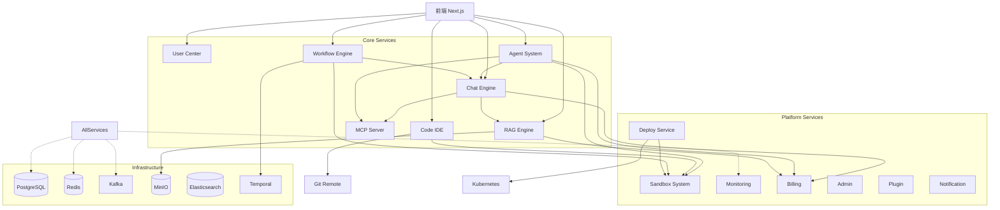

# OmniDev AI Platform — 功能边界与模块划分

## 1. 模块全景图

```
┌─────────────────────────────────────────────────────────────────────┐
│                        OmniDev AI Platform                          │
├─────────┬─────────┬─────────┬─────────┬─────────┬─────────┬────────┤
│  User   │  Chat   │  Agent  │  RAG    │  Code   │ Workflow│  MCP   │
│ Center  │ Engine  │ System  │ Engine  │   IDE   │ Engine  │ Server │
├─────────┼─────────┼─────────┼─────────┼─────────┼─────────┼────────┤
│ Deploy  │ Monitor │ Billing │  Admin  │ Plugin  │ Sandbox │Market  │
│ Service │  ing    │ Service │ Console │ System  │  System │ Place  │
├─────────┴─────────┴─────────┴─────────┴─────────┴─────────┴────────┤
│                    共享基础层 (Shared Infrastructure)                 │
│  Auth │ EventBus │ Storage │ Cache │ Search │ Queue │ Container    │
└─────────────────────────────────────────────────────────────────────┘
```

## 2. 模块详细定义

### 2.1 User Center（用户中心）

**职责：** 身份认证、权限管理、组织管理

**边界内：**
- 用户注册/登录（邮箱 + OAuth）
- JWT Token 签发与刷新
- API Key 生成与验证
- RBAC 角色权限管理
- 组织（Organization）CRUD
- 成员邀请与管理
- 用户个人设置

**边界外（不负责）：**
- 支付和计费 → Billing Service
- 模型管理 → Admin Console
- 审计日志 → Admin Console（独立存储）

**对外接口：**
```protobuf
service UserService {
  rpc Register(RegisterRequest) returns (User);
  rpc Login(LoginRequest) returns (TokenPair);
  rpc RefreshToken(RefreshRequest) returns (TokenPair);
  rpc GetProfile(GetProfileRequest) returns (User);
  rpc UpdateProfile(UpdateProfileRequest) returns (User);
}

service AuthService {
  rpc ValidateToken(ValidateRequest) returns (ValidateResponse);
  rpc CheckPermission(CheckPermRequest) returns (bool);
  rpc CreateAPIKey(CreateKeyRequest) returns (APIKey);
  rpc RevokeAPIKey(RevokeKeyRequest) returns (bool);
}

service OrgService {
  rpc CreateOrg(CreateOrgRequest) returns (Organization);
  rpc InviteMember(InviteRequest) returns (Invitation);
  rpc ListMembers(ListMembersRequest) returns (MemberList);
}
```

---

### 2.2 Chat Engine（AI 对话引擎）

**职责：** 多模型对话管理、消息流式传输、Prompt 管理

**边界内：**
- 会话（Conversation）CRUD
- 消息（Message）存储与检索
- 多模型 Adapter 路由
- 流式输出（SSE）
- Prompt 模板管理（版本、比较）
- 对话上下文窗口管理
- Token 计量

**边界外：**
- 模型配置和定价 → Admin Console
- RAG 检索 → RAG Engine（通过事件/API 调用）
- Agent 执行 → Agent System
- 工具调用 → MCP Server / Agent System

**模型 Adapter 接口：**
```go
type ModelAdapter interface {
    Chat(ctx context.Context, req ChatRequest) (<-chan ChatChunk, error)
    CountTokens(text string) int
    GetModelInfo() ModelInfo
}

// 实现：OpenAIAdapter, AnthropicAdapter, GeminiAdapter, DeepSeekAdapter, QwenAdapter, OllamaAdapter
```

**核心数据流：**
```
用户消息 → 上下文组装 → [可选: RAG 检索增强]
         → 模型 Adapter → 流式响应 → 前端渲染
         → 消息持久化 → Token 计量 → Billing
```

---

### 2.3 Agent System（Agent 系统）

**职责：** Agent 创建、执行、监控、工具调用

**边界内：**
- Agent 定义与配置
- 任务分解与规划
- 工具调用（Function Calling）
- 执行状态机管理
- 执行日志与追踪
- Agent 模板市场
- 多 Agent 协作编排

**边界外：**
- 代码沙箱执行 → Sandbox System
- MCP 工具注册和发现 → MCP Server
- 可视化工作流编辑 → Workflow Engine
- AI 模型调用 → Chat Engine（复用 Adapter）

**Agent 执行状态机：**
```
Created → Planning → Executing → [ToolCall → Waiting → Executing]
                                      ↓
                                 Success / Failed / Cancelled
```

**工具调用链：**
```
Agent Planner → 选择工具 → [内置工具直接执行]
                          → [MCP 工具 → MCP Server]
                          → [代码执行 → Sandbox]
                          → 结果回传 → 下一步规划
```

---

### 2.4 RAG Engine（RAG 引擎）

**职责：** 文档处理、向量化、检索增强

**边界内：**
- 文档上传与解析（PDF/Word/PPT/Excel/MD）
- OCR 文字识别
- 文档 Chunk 分块
- Embedding 向量化
- 向量存储与索引
- Hybrid Search（向量 + BM25）
- Rerank 重排序
- 知识库 CRUD
- 引用溯源

**边界外：**
- 文件存储 → MinIO（对象存储）
- AI 生成回答 → Chat Engine
- GitHub 仓库克隆 → Git Service
- 代码 AST 解析 → Code Service

**RAG Pipeline：**
```
文档上传 → MinIO 存储 → 文档解析 → OCR（如需）
         → Chunk 分块 → Embedding → pgvector 存储
         → 索引更新

查询流程：
用户问题 → Query Embedding → 向量检索 (Top-K)
         → BM25 关键词检索 → Rerank → 上下文组装
         → 注入 Chat Engine → 生成回答（含引用）
```

---

### 2.5 Code IDE（在线 IDE）

**职责：** 代码编辑、终端、Git 操作

**边界内：**
- Monaco Editor 集成
- 语法高亮、自动补全（非 AI）
- 文件树管理
- 多 Tab 编辑
- 终端模拟（xterm.js）
- Git 操作（commit/push/pull/branch/merge）
- Diff 可视化
- 文件搜索与替换
- 项目工作区管理

**边界外：**
- AI 代码补全 → Chat Engine（通过 LSP 协议）
- Agent 代码修改 → Agent System
- 代码执行 → Sandbox System
- 代码存储 → MinIO / Git Repository

**IDE 架构：**
```
浏览器 (Monaco + xterm.js)
    ↕ WebSocket
IDE Service (Go)
    ↕ gRPC
┌───────────┬──────────────┬─────────────┐
│ File Svc  │  Git Svc     │ Terminal Svc│
│ (CRUD)    │ (libgit2)    │ (PTY)       │
└───────────┴──────────────┴─────────────┘
    ↕                    ↕
  MinIO              Git Remote
```

---

### 2.6 Workflow Engine（工作流引擎）

**职责：** 可视化工作流编排与执行

**边界内：**
- 工作流 CRUD
- 可视化画布编辑器（前端）
- 节点类型定义与注册
- 工作流解析与执行（基于 Temporal）
- 条件分支与循环
- 执行历史与日志
- 触发器管理（手动/Cron/Webhook）
- 变量和数据映射

**边界外：**
- 节点实际执行 → 各对应服务（Chat/HTTP/SQL/Sandbox）
- 定时调度 → Temporal Cron Schedule
- 外部通知 → Notification Service

**节点类型注册表：**
```go
type NodeExecutor interface {
    Type() string
    Execute(ctx NodeContext) (NodeOutput, error)
    Schema() NodeSchema  // 参数定义，供前端渲染配置表单
}

// 内置节点：
// - AI Node        → 调用 Chat Engine
// - HTTP Node      → 调用外部 API
// - SQL Node       → 查询数据库
// - Code Node      → 执行代码（Sandbox）
// - Condition Node → 分支判断
// - Loop Node      → 循环控制
// - Email Node     → 发送邮件
// - Slack Node     → 发送 Slack 消息
// - Transform Node → 数据转换（JMESPath）
```

---

### 2.7 MCP Server（MCP 服务管理）

**职责：** MCP 协议实现、工具注册与发现、传输管理

**边界内：**
- MCP 协议实现（Server/Client）
- 内置 MCP Server 管理
- 自定义 MCP Server 配置
- 工具发现与 Schema 管理
- SSE / Stdio 传输层
- 工具调用路由
- 调用日志与计费

**边界外：**
- 工具的实际执行逻辑 → 各具体实现
- Agent 中的工具选择 → Agent System
- 前端工具测试 UI → Chat/Agent 前端

**内置 MCP Server 列表：**
| Server | 能力 |
|--------|------|
| Filesystem | 文件读写、目录管理 |
| GitHub | 仓库操作、PR/Issue 管理 |
| Browser | 网页访问、截图、数据提取 |
| SQL | 数据库查询（PostgreSQL/MySQL/SQLite） |
| Docker | 容器管理、镜像操作 |
| K8s | 集群管理、Pod 操作 |
| Notion | 页面/数据库 CRUD |
| Jira | Issue 管理 |
| Figma | 设计稿访问 |

---

### 2.8 Sandbox System（沙箱系统）

**职责：** 安全隔离的代码执行环境

**边界内：**
- Docker 容器生命周期管理
- 多语言运行时镜像（Python/Go/Node/Rust/Java）
- 资源限制（CPU/内存/磁盘/网络）
- 文件系统挂载与隔离
- 网络策略管理
- 执行结果收集
- 超时与清理

**边界外：**
- 容器编排 → Kubernetes
- 镜像仓库 → Docker Registry
- Agent 调用逻辑 → Agent System

**安全约束：**
```yaml
sandbox:
  resource_limits:
    cpu: "2"
    memory: "2Gi"
    disk: "10Gi"
    timeout: "300s"
  network:
    mode: "none"        # 默认无网络
    allowed_hosts: []    # 白名单
  filesystem:
    readonly_root: true
    mounts:
      - type: "tmpfs"
        path: "/workspace"
        size: "5Gi"
```

---

### 2.9 Deploy Service（部署服务）

**职责：** 应用构建、部署、域名管理

**边界内：**
- Dockerfile 自动生成（buildpack 检测）
- Docker 镜像构建与推送
- Kubernetes 部署（Helm Chart）
- 多云部署（Terraform）
- 域名绑定与 SSL 证书
- 部署历史与回滚
- 环境变量管理
- 自定义构建命令

**边界外：**
- CI/CD 触发 → Workflow Engine
- 监控数据 → Monitoring Service
- 容器运行 → Kubernetes / Docker

---

### 2.10 Monitoring Service（监控服务）

**职责：** 指标收集、日志聚合、链路追踪

**边界内：**
- Prometheus 指标采集与存储
- Grafana Dashboard 管理
- Loki 日志聚合与查询
- Jaeger 链路追踪
- 告警规则管理
- 通知渠道管理（Webhook/Email/Slack）
- AI 异常检测（P2）

**边界外：**
- 应用埋点 → 各业务服务（OpenTelemetry SDK）
- 告警执行 → Notification Service

---

### 2.11 Billing Service（计费服务）

**职责：** 用量计量、账单生成、支付集成

**边界内：**
- Token 用量统计与存储
- 按模型/功能计费规则
- 账单生成与查询
- 预算告警
- 支付集成（Stripe/微信/支付宝）
- 发票生成
- 团队配额管理

**边界外：**
- Token 计量数据来源 → Chat Engine
- 存储用量 → MinIO / RAG Engine
- 计算用量 → Sandbox / Deploy

---

### 2.12 Admin Console（管理后台）

**职责：** 平台运营管理

**边界内：**
- 用户管理（列表/搜索/封禁）
- 模型管理（添加/编辑/下线/定价）
- 系统配置（功能开关/限额）
- 审计日志查询
- 数据统计与导出
- 系统健康监控

**边界外：**
- 具体业务逻辑 → 各业务服务
- 底层数据 → 各服务数据库（只读副本）

---

### 2.13 Plugin System（插件系统）

**职责：** 扩展性框架

**边界内：**
- 插件注册与发现
- 插件生命周期管理
- 插件沙箱隔离
- 插件 API 定义
- 插件市场（元数据）

**边界外：**
- 插件实际执行 → 各对应模块
- 市场 UI → 前端

---

### 2.14 Notification Service（通知服务）

**职责：** 统一消息通知

**边界内：**
- 通知渠道管理（Email/Slack/Webhook/站内信）
- 通知模板管理
- 通知发送与重试
- 通知偏好设置
- 通知历史

**边界外：**
- 触发源 → 各业务服务（通过事件总线）

---

## 3. 模块依赖关系图



---

## 4. 数据所有权矩阵

| 数据类型 | 所属服务 | 存储位置 | 其他服务访问方式 |
|----------|----------|----------|------------------|
| 用户信息 | User Center | PostgreSQL | gRPC |
| 权限数据 | User Center | PostgreSQL + Redis | gRPC + Redis 读 |
| 对话消息 | Chat Engine | PostgreSQL | gRPC（只读） |
| Prompt 模板 | Chat Engine | PostgreSQL | gRPC |
| Agent 定义 | Agent System | PostgreSQL | gRPC |
| Agent 执行日志 | Agent System | PostgreSQL + ES | gRPC + ES 查询 |
| 文档内容 | RAG Engine | MinIO + PostgreSQL | gRPC |
| 向量数据 | RAG Engine | PostgreSQL (pgvector) | 直接 SQL（同库） |
| 代码文件 | Code IDE | MinIO / Git | 文件 API |
| 工作流定义 | Workflow Engine | PostgreSQL | gRPC |
| 工作流执行 | Workflow Engine | Temporal + PostgreSQL | Temporal API |
| MCP 配置 | MCP Server | PostgreSQL | gRPC |
| 部署记录 | Deploy Service | PostgreSQL | gRPC |
| 指标数据 | Monitoring | Prometheus | PromQL |
| 日志数据 | Monitoring | Loki | LogQL |
| 账单数据 | Billing | PostgreSQL | gRPC |
| 审计日志 | Admin | PostgreSQL + ES | gRPC + ES |

---

## 5. 服务通信矩阵

| 调用方 | 被调用方 | 协议 | 场景 |
|--------|----------|------|------|
| Frontend | 所有服务 | HTTP/REST (Gateway) | 用户请求 |
| Gateway | 各服务 | gRPC | 内部路由 |
| Chat Engine | RAG Engine | gRPC | RAG 检索增强 |
| Chat Engine | Model Providers | HTTP | AI 模型调用 |
| Agent System | Chat Engine | gRPC | AI 推理 |
| Agent System | MCP Server | gRPC | 工具调用 |
| Agent System | Sandbox | gRPC | 代码执行 |
| Workflow Engine | Temporal | gRPC | 任务调度 |
| 所有服务 | Kafka | Kafka Protocol | 异步事件 |
| 所有服务 | PostgreSQL | SQL | 数据持久化 |
| 所有服务 | Redis | Redis Protocol | 缓存/会话 |
