# OmniDev AI Platform — 系统架构

## 1. 整体架构（C4 Level 1 — 系统上下文）

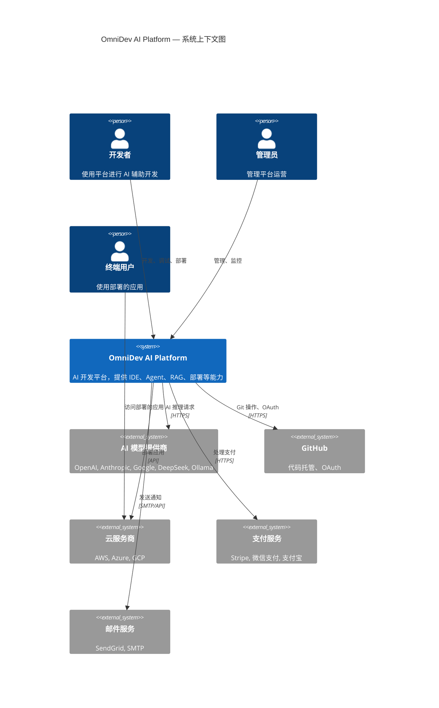

---

## 2. 分层架构（C4 Level 2 — 容器图）

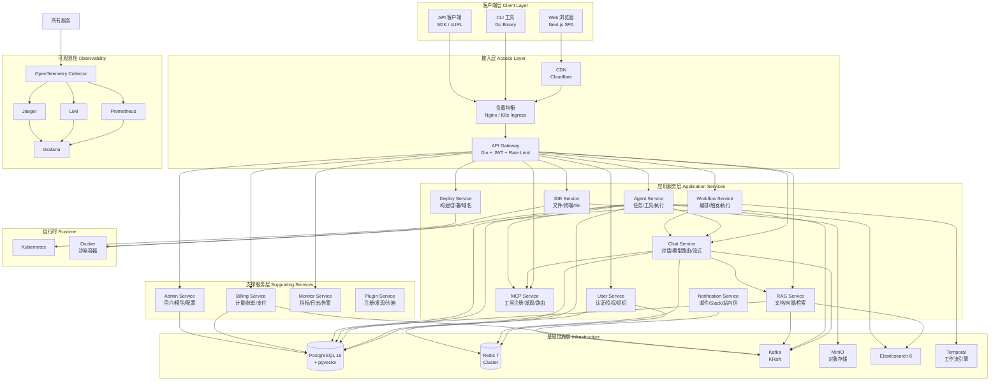

---

## 3. 微服务架构（C4 Level 3 — 组件图）

### 3.1 API Gateway

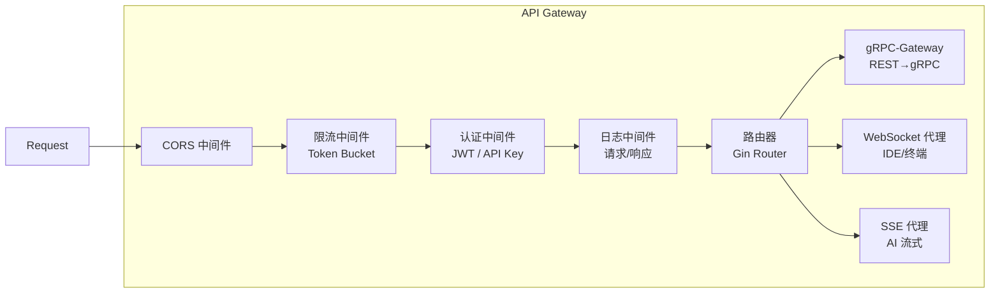

### 3.2 Chat Service

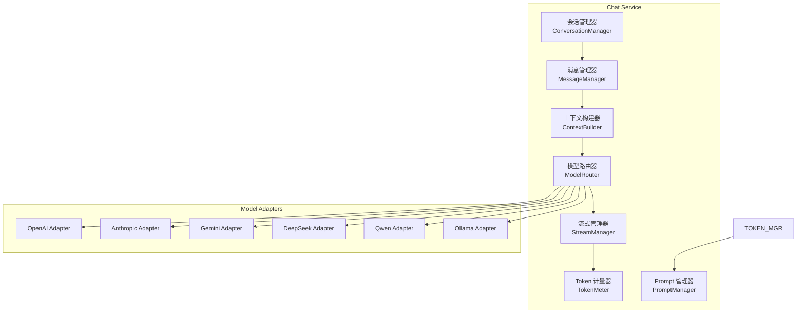

### 3.3 Agent Service

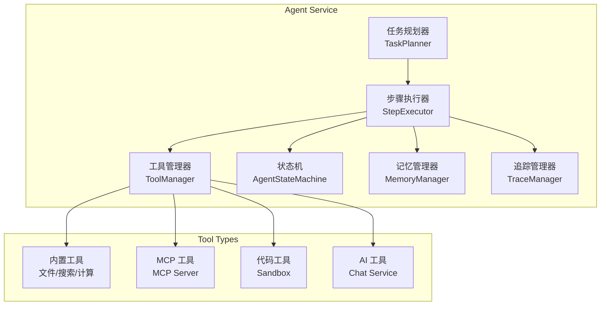

### 3.4 RAG Service

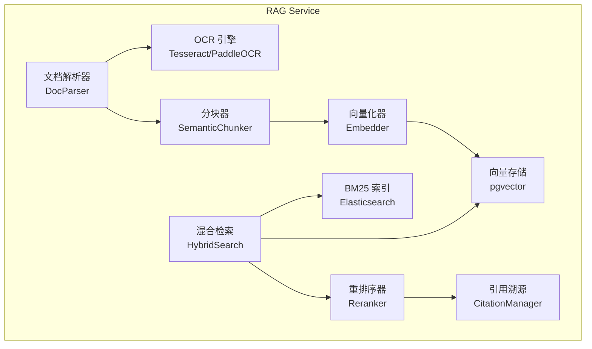

---

## 4. 数据流架构

### 4.1 AI 对话流

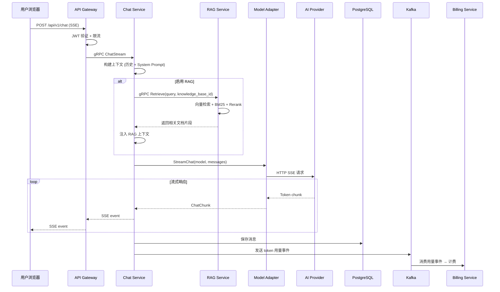

### 4.2 Agent 执行流

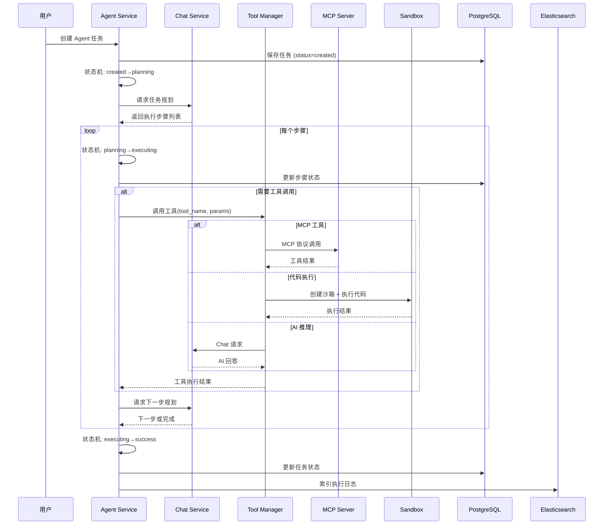

### 4.3 RAG 文档处理流

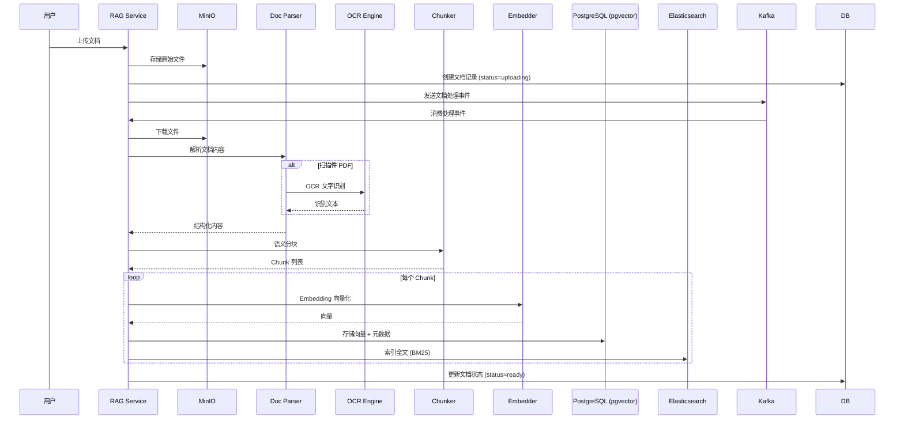

---

## 5. 部署架构

### 5.1 Kubernetes 集群拓扑

```mermaid
graph TB
    subgraph "Kubernetes Cluster"
        subgraph "Ingress"
            INGRESS["Nginx Ingress Controller"]
        end

        subgraph "Application Namespace"
            GW["API Gateway<br/>Deployment × 3"]
            USER["User Service<br/>Deployment × 2"]
            CHAT["Chat Service<br/>Deployment × 3"]
            AGENT["Agent Service<br/>Deployment × 2"]
            RAG["RAG Service<br/>Deployment × 2"]
            IDE["IDE Service<br/>Deployment × 3"]
            WF["Workflow Service<br/>Deployment × 2"]
            MCP["MCP Service<br/>Deployment × 2"]
            DEPLOY["Deploy Service<br/>Deployment × 1"]
            BILLING["Billing Service<br/>Deployment × 2"]
            ADMIN["Admin Service<br/>Deployment × 1"]
            NOTIFY["Notification<br/>Deployment × 2"]
        end

        subgraph "Sandbox Namespace"
            SANDBOX_POOL["Sandbox Pool<br/>DaemonSet / Node Pool"]
        end

        subgraph "Data Namespace"
            PG["PostgreSQL<br/>StatefulSet (Primary + Replica)"]
            REDIS["Redis<br/>StatefulSet (Cluster)"]
            KAFKA["Kafka<br/>StatefulSet (3 Brokers)"]
            MINIO["MinIO<br/>StatefulSet (4 Nodes)"]
            ES["Elasticsearch<br/>StatefulSet (3 Nodes)"]
            TEMPORAL["Temporal<br/>Deployment"]
        end

        subgraph "Monitoring Namespace"
            PROM["Prometheus<br/>StatefulSet"]
            GRAFANA["Grafana<br/>Deployment"]
            LOKI["Loki<br/>StatefulSet"]
            JAEGER["Jaeger<br/>Deployment"]
            OTEL["OTel Collector<br/>DaemonSet"]
        end
    end

    INGRESS --> GW
    GW --> USER
    GW --> CHAT
    GW --> AGENT
    GW --> RAG
    GW --> IDE
    GW --> WF
    GW --> MCP
    GW --> DEPLOY
    GW --> BILLING
    GW --> ADMIN

    CHAT --> PG
    CHAT --> REDIS
    AGENT --> PG
    AGENT --> SANDBOX_POOL
    RAG --> PG
    RAG --> ES
    IDE --> MINIO
    WF --> TEMPORAL
    BILLING --> PG

    ALL_SVC["所有服务"] --> OTEL
    OTEL --> PROM
    OTEL --> LOKI
    OTEL --> JAEGER
```

### 5.2 网络架构

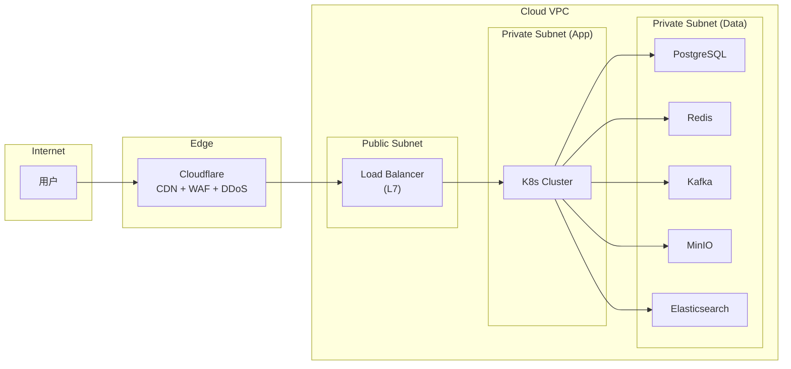

---

## 6. 安全架构

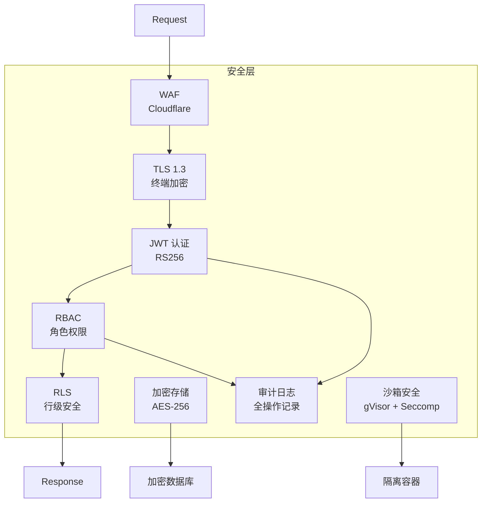

---

## 7. 事件驱动架构

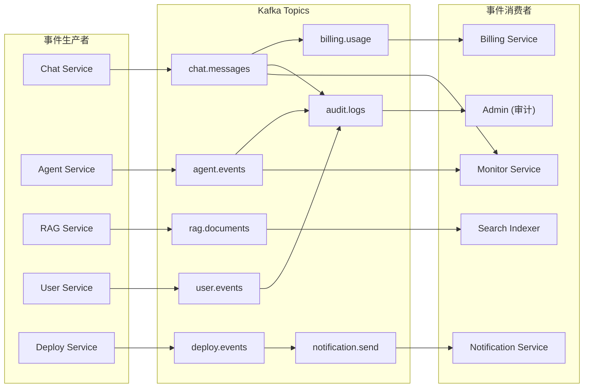

---

## 8. AI 模型路由架构

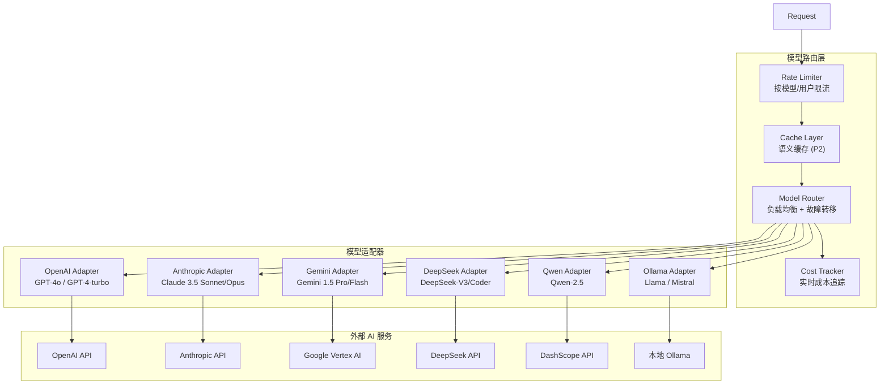

---

## 9. Sandbox 架构

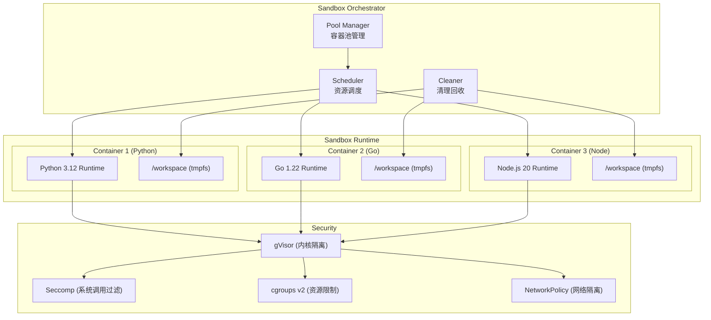

---

## 10. Workflow 执行架构

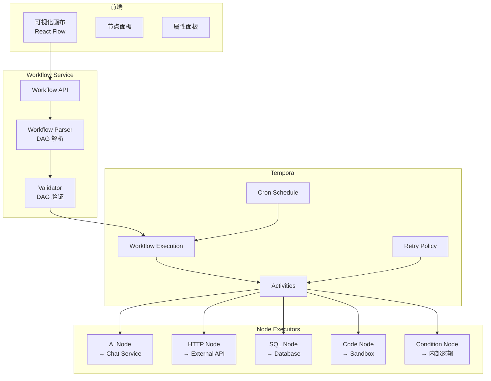
