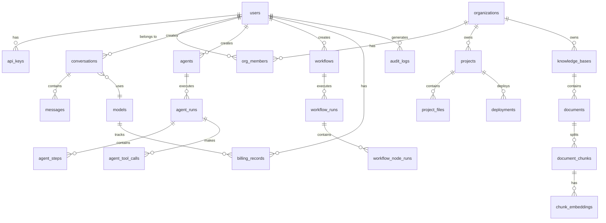

# OmniDev AI Platform — 数据库设计

## 1. 设计原则

1. **UUID 主键**：所有表使用 UUID v7（时间有序）作为主键
2. **时间戳**：所有表包含 `created_at`、`updated_at`（TIMESTAMPTZ）
3. **软删除**：核心业务表使用 `deleted_at`（TIMESTAMPTZ）软删除
4. **多租户**：通过 `org_id` + RLS 实现行级隔离
5. **JSONB 灵活字段**：配置、元数据等使用 JSONB
6. **向量存储**：使用 pgvector 扩展存储 Embedding
7. **分区**：大表按时间分区（消息、日志、向量）

## 2. ER 总览



---

## 3. 用户中心模块

### 3.1 users（用户表）

```sql
CREATE TABLE users (
    id            UUID PRIMARY KEY DEFAULT gen_random_uuid(),
    email         VARCHAR(255) NOT NULL UNIQUE,
    email_verified BOOLEAN NOT NULL DEFAULT FALSE,
    password_hash VARCHAR(255),           -- OAuth 用户可为空
    nickname      VARCHAR(100) NOT NULL,
    avatar_url    VARCHAR(500),
    bio           TEXT,
    role          VARCHAR(20) NOT NULL DEFAULT 'user',  -- user, admin, super_admin
    status        VARCHAR(20) NOT NULL DEFAULT 'active', -- active, suspended, deleted
    last_login_at TIMESTAMPTZ,
    last_login_ip INET,
    settings      JSONB NOT NULL DEFAULT '{}',  -- 用户偏好设置
    metadata      JSONB NOT NULL DEFAULT '{}',
    created_at    TIMESTAMPTZ NOT NULL DEFAULT NOW(),
    updated_at    TIMESTAMPTZ NOT NULL DEFAULT NOW(),
    deleted_at    TIMESTAMPTZ
);

CREATE INDEX idx_users_email ON users(email) WHERE deleted_at IS NULL;
CREATE INDEX idx_users_status ON users(status) WHERE deleted_at IS NULL;
CREATE INDEX idx_users_created_at ON users(created_at);
```

### 3.2 oauth_connections（OAuth 关联）

```sql
CREATE TABLE oauth_connections (
    id            UUID PRIMARY KEY DEFAULT gen_random_uuid(),
    user_id       UUID NOT NULL REFERENCES users(id),
    provider      VARCHAR(50) NOT NULL,   -- github, google, gitlab
    provider_uid  VARCHAR(255) NOT NULL,
    access_token  TEXT,                    -- 加密存储
    refresh_token TEXT,                    -- 加密存储
    expires_at    TIMESTAMPTZ,
    scope         TEXT,
    raw_profile   JSONB,
    created_at    TIMESTAMPTZ NOT NULL DEFAULT NOW(),
    updated_at    TIMESTAMPTZ NOT NULL DEFAULT NOW(),

    UNIQUE(provider, provider_uid)
);

CREATE INDEX idx_oauth_user ON oauth_connections(user_id);
```

### 3.3 api_keys（API Key）

```sql
CREATE TABLE api_keys (
    id            UUID PRIMARY KEY DEFAULT gen_random_uuid(),
    user_id       UUID NOT NULL REFERENCES users(id),
    name          VARCHAR(100) NOT NULL,
    key_hash      VARCHAR(64) NOT NULL UNIQUE,  -- SHA-256 哈希
    key_prefix    VARCHAR(10) NOT NULL,          -- 前缀用于展示 (sk-xxx...xxx)
    scopes        TEXT[] NOT NULL DEFAULT '{}',   -- 权限范围
    expires_at    TIMESTAMPTZ,
    last_used_at  TIMESTAMPTZ,
    last_used_ip  INET,
    status        VARCHAR(20) NOT NULL DEFAULT 'active', -- active, revoked
    created_at    TIMESTAMPTZ NOT NULL DEFAULT NOW(),
    updated_at    TIMESTAMPTZ NOT NULL DEFAULT NOW()
);

CREATE INDEX idx_api_keys_user ON api_keys(user_id);
CREATE INDEX idx_api_keys_hash ON api_keys(key_hash) WHERE status = 'active';
```

### 3.4 organizations（组织）

```sql
CREATE TABLE organizations (
    id            UUID PRIMARY KEY DEFAULT gen_random_uuid(),
    name          VARCHAR(100) NOT NULL,
    slug          VARCHAR(100) NOT NULL UNIQUE,
    description   TEXT,
    avatar_url    VARCHAR(500),
    plan          VARCHAR(20) NOT NULL DEFAULT 'free', -- free, pro, team, enterprise
    settings      JSONB NOT NULL DEFAULT '{}',
    metadata      JSONB NOT NULL DEFAULT '{}',
    created_at    TIMESTAMPTZ NOT NULL DEFAULT NOW(),
    updated_at    TIMESTAMPTZ NOT NULL DEFAULT NOW(),
    deleted_at    TIMESTAMPTZ
);
```

### 3.5 org_members（组织成员）

```sql
CREATE TABLE org_members (
    id            UUID PRIMARY KEY DEFAULT gen_random_uuid(),
    org_id        UUID NOT NULL REFERENCES organizations(id),
    user_id       UUID NOT NULL REFERENCES users(id),
    role          VARCHAR(20) NOT NULL DEFAULT 'member', -- owner, admin, member, viewer
    invited_by    UUID REFERENCES users(id),
    joined_at     TIMESTAMPTZ NOT NULL DEFAULT NOW(),
    created_at    TIMESTAMPTZ NOT NULL DEFAULT NOW(),
    updated_at    TIMESTAMPTZ NOT NULL DEFAULT NOW(),

    UNIQUE(org_id, user_id)
);

CREATE INDEX idx_org_members_org ON org_members(org_id);
CREATE INDEX idx_org_members_user ON org_members(user_id);
```

### 3.6 roles（角色定义）

```sql
CREATE TABLE roles (
    id            UUID PRIMARY KEY DEFAULT gen_random_uuid(),
    org_id        UUID REFERENCES organizations(id),  -- NULL = 系统角色
    name          VARCHAR(50) NOT NULL,
    description   TEXT,
    permissions   JSONB NOT NULL DEFAULT '[]',  -- 权限列表
    is_system     BOOLEAN NOT NULL DEFAULT FALSE,
    created_at    TIMESTAMPTZ NOT NULL DEFAULT NOW(),
    updated_at    TIMESTAMPTZ NOT NULL DEFAULT NOW(),

    UNIQUE(org_id, name)
);
```

---

## 4. AI Chat 模块

### 4.1 models（模型配置）

```sql
CREATE TABLE models (
    id            UUID PRIMARY KEY DEFAULT gen_random_uuid(),
    provider      VARCHAR(50) NOT NULL,    -- openai, anthropic, google, deepseek, qwen, ollama
    model_id      VARCHAR(100) NOT NULL,   -- gpt-4o, claude-3-5-sonnet, etc.
    display_name  VARCHAR(100) NOT NULL,
    description   TEXT,
    context_window INT NOT NULL DEFAULT 4096,
    max_output    INT NOT NULL DEFAULT 4096,
    supports_streaming BOOLEAN NOT NULL DEFAULT TRUE,
    supports_vision BOOLEAN NOT NULL DEFAULT FALSE,
    supports_tools  BOOLEAN NOT NULL DEFAULT FALSE,
    input_price   DECIMAL(10,6),           -- 每 1K tokens 价格
    output_price  DECIMAL(10,6),
    is_active     BOOLEAN NOT NULL DEFAULT TRUE,
    config        JSONB NOT NULL DEFAULT '{}',  -- 模型特定配置
    created_at    TIMESTAMPTZ NOT NULL DEFAULT NOW(),
    updated_at    TIMESTAMPTZ NOT NULL DEFAULT NOW(),

    UNIQUE(provider, model_id)
);
```

### 4.2 conversations（对话）

```sql
CREATE TABLE conversations (
    id            UUID PRIMARY KEY DEFAULT gen_random_uuid(),
    user_id       UUID NOT NULL REFERENCES users(id),
    org_id        UUID REFERENCES organizations(id),
    title         VARCHAR(255),
    model_id      UUID REFERENCES models(id),
    system_prompt TEXT,
    settings      JSONB NOT NULL DEFAULT '{}',  -- temperature, top_p 等
    status        VARCHAR(20) NOT NULL DEFAULT 'active', -- active, archived
    pinned        BOOLEAN NOT NULL DEFAULT FALSE,
    tags          TEXT[] NOT NULL DEFAULT '{}',
    metadata      JSONB NOT NULL DEFAULT '{}',
    created_at    TIMESTAMPTZ NOT NULL DEFAULT NOW(),
    updated_at    TIMESTAMPTZ NOT NULL DEFAULT NOW(),
    deleted_at    TIMESTAMPTZ
);

CREATE INDEX idx_conversations_user ON conversations(user_id) WHERE deleted_at IS NULL;
CREATE INDEX idx_conversations_org ON conversations(org_id) WHERE deleted_at IS NULL;
CREATE INDEX idx_conversations_created ON conversations(created_at DESC);
```

### 4.3 messages（消息）

```sql
-- 按月分区
CREATE TABLE messages (
    id            UUID NOT NULL DEFAULT gen_random_uuid(),
    conversation_id UUID NOT NULL,
    role          VARCHAR(20) NOT NULL,    -- user, assistant, system, tool
    content       TEXT NOT NULL,
    model_id      UUID REFERENCES models(id),
    token_input   INT,                     -- 输入 token 数
    token_output  INT,                     -- 输出 token 数
    latency_ms    INT,                     -- 响应延迟
    tool_calls    JSONB,                   -- 工具调用详情
    tool_call_id  VARCHAR(255),            -- 工具结果关联
    parent_id     UUID,                    -- 分支对话
    metadata      JSONB NOT NULL DEFAULT '{}',
    created_at    TIMESTAMPTZ NOT NULL DEFAULT NOW(),

    PRIMARY KEY (id, created_at)  -- 分区键
) PARTITION BY RANGE (created_at);

-- 创建月度分区
CREATE TABLE messages_2026_01 PARTITION OF messages
    FOR VALUES FROM ('2026-01-01') TO ('2026-02-01');
CREATE TABLE messages_2026_02 PARTITION OF messages
    FOR VALUES FROM ('2026-02-01') TO ('2026-03-01');
-- ... 按月创建

CREATE INDEX idx_messages_conversation ON messages(conversation_id, created_at DESC);
CREATE INDEX idx_messages_created ON messages(created_at DESC);
```

### 4.4 prompt_templates（Prompt 模板）

```sql
CREATE TABLE prompt_templates (
    id            UUID PRIMARY KEY DEFAULT gen_random_uuid(),
    user_id       UUID NOT NULL REFERENCES users(id),
    org_id        UUID REFERENCES organizations(id),
    title         VARCHAR(255) NOT NULL,
    content       TEXT NOT NULL,
    description   TEXT,
    category      VARCHAR(50),
    tags          TEXT[] NOT NULL DEFAULT '{}',
    variables     JSONB NOT NULL DEFAULT '[]',  -- 模板变量定义
    visibility    VARCHAR(20) NOT NULL DEFAULT 'private', -- private, org, public
    version       INT NOT NULL DEFAULT 1,
    fork_from     UUID REFERENCES prompt_templates(id),
    use_count     INT NOT NULL DEFAULT 0,
    like_count    INT NOT NULL DEFAULT 0,
    metadata      JSONB NOT NULL DEFAULT '{}',
    created_at    TIMESTAMPTZ NOT NULL DEFAULT NOW(),
    updated_at    TIMESTAMPTZ NOT NULL DEFAULT NOW(),
    deleted_at    TIMESTAMPTZ
);

CREATE INDEX idx_prompts_user ON prompt_templates(user_id) WHERE deleted_at IS NULL;
CREATE INDEX idx_prompts_visibility ON prompt_templates(visibility) WHERE deleted_at IS NULL;
CREATE INDEX idx_prompts_tags ON prompt_templates USING GIN(tags);
```

---

## 5. Agent 模块

### 5.1 agents（Agent 定义）

```sql
CREATE TABLE agents (
    id            UUID PRIMARY KEY DEFAULT gen_random_uuid(),
    user_id       UUID NOT NULL REFERENCES users(id),
    org_id        UUID REFERENCES organizations(id),
    name          VARCHAR(100) NOT NULL,
    description   TEXT,
    avatar_url    VARCHAR(500),
    system_prompt TEXT NOT NULL,
    model_id      UUID REFERENCES models(id),
    tools         JSONB NOT NULL DEFAULT '[]',    -- 工具配置
    mcp_servers   JSONB NOT NULL DEFAULT '[]',    -- MCP Server 配置
    config        JSONB NOT NULL DEFAULT '{}',    -- 温度、最大步数等
    visibility    VARCHAR(20) NOT NULL DEFAULT 'private',
    is_template   BOOLEAN NOT NULL DEFAULT FALSE,
    template_category VARCHAR(50),
    metadata      JSONB NOT NULL DEFAULT '{}',
    created_at    TIMESTAMPTZ NOT NULL DEFAULT NOW(),
    updated_at    TIMESTAMPTZ NOT NULL DEFAULT NOW(),
    deleted_at    TIMESTAMPTZ
);

CREATE INDEX idx_agents_user ON agents(user_id) WHERE deleted_at IS NULL;
CREATE INDEX idx_agents_template ON agents(is_template, template_category) WHERE deleted_at IS NULL;
```

### 5.2 agent_runs（Agent 执行记录）

```sql
CREATE TABLE agent_runs (
    id            UUID PRIMARY KEY DEFAULT gen_random_uuid(),
    agent_id      UUID NOT NULL REFERENCES agents(id),
    user_id       UUID NOT NULL REFERENCES users(id),
    task          TEXT NOT NULL,
    status        VARCHAR(20) NOT NULL DEFAULT 'created',
        -- created, planning, executing, waiting_tool, success, failed, cancelled
    result        TEXT,
    error         TEXT,
    total_steps   INT NOT NULL DEFAULT 0,
    completed_steps INT NOT NULL DEFAULT 0,
    token_input   INT NOT NULL DEFAULT 0,
    token_output  INT NOT NULL DEFAULT 0,
    cost          DECIMAL(10,6) NOT NULL DEFAULT 0,
    started_at    TIMESTAMPTZ,
    completed_at  TIMESTAMPTZ,
    metadata      JSONB NOT NULL DEFAULT '{}',
    created_at    TIMESTAMPTZ NOT NULL DEFAULT NOW(),
    updated_at    TIMESTAMPTZ NOT NULL DEFAULT NOW()
);

CREATE INDEX idx_agent_runs_agent ON agent_runs(agent_id, created_at DESC);
CREATE INDEX idx_agent_runs_user ON agent_runs(user_id, created_at DESC);
CREATE INDEX idx_agent_runs_status ON agent_runs(status) WHERE status IN ('created', 'planning', 'executing');
```

### 5.3 agent_steps（Agent 执行步骤）

```sql
CREATE TABLE agent_steps (
    id            UUID PRIMARY KEY DEFAULT gen_random_uuid(),
    run_id        UUID NOT NULL REFERENCES agent_runs(id),
    step_number   INT NOT NULL,
    type          VARCHAR(30) NOT NULL,    -- think, tool_call, code_exec, response
    content       TEXT,
    tool_name     VARCHAR(100),
    tool_input    JSONB,
    tool_output   JSONB,
    status        VARCHAR(20) NOT NULL DEFAULT 'pending',
        -- pending, running, success, failed, skipped
    error         TEXT,
    token_input   INT,
    token_output  INT,
    latency_ms    INT,
    started_at    TIMESTAMPTZ,
    completed_at  TIMESTAMPTZ,
    created_at    TIMESTAMPTZ NOT NULL DEFAULT NOW(),

    UNIQUE(run_id, step_number)
);

CREATE INDEX idx_agent_steps_run ON agent_steps(run_id, step_number);
```

---

## 6. RAG 模块

### 6.1 knowledge_bases（知识库）

```sql
CREATE TABLE knowledge_bases (
    id            UUID PRIMARY KEY DEFAULT gen_random_uuid(),
    user_id       UUID NOT NULL REFERENCES users(id),
    org_id        UUID REFERENCES organizations(id),
    name          VARCHAR(100) NOT NULL,
    description   TEXT,
    embedding_model VARCHAR(100) NOT NULL DEFAULT 'text-embedding-3-small',
    chunk_size    INT NOT NULL DEFAULT 512,
    chunk_overlap INT NOT NULL DEFAULT 50,
    doc_count     INT NOT NULL DEFAULT 0,
    chunk_count   INT NOT NULL DEFAULT 0,
    total_tokens  BIGINT NOT NULL DEFAULT 0,
    total_size    BIGINT NOT NULL DEFAULT 0,  -- 字节
    settings      JSONB NOT NULL DEFAULT '{}',
    status        VARCHAR(20) NOT NULL DEFAULT 'active',
    created_at    TIMESTAMPTZ NOT NULL DEFAULT NOW(),
    updated_at    TIMESTAMPTZ NOT NULL DEFAULT NOW(),
    deleted_at    TIMESTAMPTZ
);

CREATE INDEX idx_kb_user ON knowledge_bases(user_id) WHERE deleted_at IS NULL;
CREATE INDEX idx_kb_org ON knowledge_bases(org_id) WHERE deleted_at IS NULL;
```

### 6.2 documents（文档）

```sql
CREATE TABLE documents (
    id            UUID PRIMARY KEY DEFAULT gen_random_uuid(),
    knowledge_base_id UUID NOT NULL REFERENCES knowledge_bases(id),
    filename      VARCHAR(255) NOT NULL,
    file_type     VARCHAR(50) NOT NULL,    -- pdf, docx, pptx, xlsx, md, txt
    file_size     BIGINT NOT NULL,
    file_url      VARCHAR(500) NOT NULL,   -- MinIO URL
    status        VARCHAR(20) NOT NULL DEFAULT 'uploading',
        -- uploading, processing, ready, failed
    error         TEXT,
    chunk_count   INT NOT NULL DEFAULT 0,
    total_tokens  BIGINT NOT NULL DEFAULT 0,
    metadata      JSONB NOT NULL DEFAULT '{}',  -- 页数、作者等
    processed_at  TIMESTAMPTZ,
    created_at    TIMESTAMPTZ NOT NULL DEFAULT NOW(),
    updated_at    TIMESTAMPTZ NOT NULL DEFAULT NOW(),
    deleted_at    TIMESTAMPTZ
);

CREATE INDEX idx_docs_kb ON documents(knowledge_base_id) WHERE deleted_at IS NULL;
CREATE INDEX idx_docs_status ON documents(status) WHERE status != 'ready';
```

### 6.3 document_chunks（文档分块）

```sql
CREATE TABLE document_chunks (
    id            UUID PRIMARY KEY DEFAULT gen_random_uuid(),
    document_id   UUID NOT NULL REFERENCES documents(id),
    knowledge_base_id UUID NOT NULL REFERENCES knowledge_bases(id),
    chunk_index   INT NOT NULL,
    content       TEXT NOT NULL,
    content_length INT NOT NULL,
    token_count   INT NOT NULL,
    start_page    INT,
    end_page      INT,
    heading       TEXT,                    -- 所属标题
    metadata      JSONB NOT NULL DEFAULT '{}',
    embedding     vector(1536),            -- pgvector 向量
    created_at    TIMESTAMPTZ NOT NULL DEFAULT NOW(),

    UNIQUE(document_id, chunk_index)
);

CREATE INDEX idx_chunks_doc ON document_chunks(document_id);
CREATE INDEX idx_chunks_kb ON document_chunks(knowledge_base_id);

-- HNSW 向量索引（高性能近似搜索）
CREATE INDEX idx_chunks_embedding ON document_chunks
    USING hnsw (embedding vector_cosine_ops)
    WITH (m = 16, ef_construction = 64);

-- 也支持 IVFFlat（适合小数据集）
-- CREATE INDEX idx_chunks_embedding_ivf ON document_chunks
--     USING ivfflat (embedding vector_cosine_ops)
--     WITH (lists = 100);
```

### 6.4 document_chunk_fts（全文搜索索引，可选 ES 替代）

```sql
-- 使用 tsvector 进行全文搜索
ALTER TABLE document_chunks ADD COLUMN content_tsv tsvector;

CREATE INDEX idx_chunks_fts ON document_chunks USING GIN(content_tsv);

-- 中文分词触发器
CREATE OR REPLACE FUNCTION update_chunk_tsv() RETURNS trigger AS $$
BEGIN
    NEW.content_tsv := to_tsvector('zhcfg', NEW.content);
    RETURN NEW;
END;
$$ LANGUAGE plpgsql;

CREATE TRIGGER trg_chunk_tsv
    BEFORE INSERT OR UPDATE ON document_chunks
    FOR EACH ROW EXECUTE FUNCTION update_chunk_tsv();
```

---

## 7. Code IDE 模块

### 7.1 projects（项目）

```sql
CREATE TABLE projects (
    id            UUID PRIMARY KEY DEFAULT gen_random_uuid(),
    user_id       UUID NOT NULL REFERENCES users(id),
    org_id        UUID REFERENCES organizations(id),
    name          VARCHAR(100) NOT NULL,
    description   TEXT,
    language      VARCHAR(50),             -- 主要语言
    framework     VARCHAR(50),             -- 使用框架
    git_url       VARCHAR(500),            -- Git 仓库 URL
    git_branch    VARCHAR(100) DEFAULT 'main',
    default_branch VARCHAR(100) DEFAULT 'main',
    template      VARCHAR(50),             -- 项目模板
    settings      JSONB NOT NULL DEFAULT '{}',
    status        VARCHAR(20) NOT NULL DEFAULT 'active',
    metadata      JSONB NOT NULL DEFAULT '{}',
    created_at    TIMESTAMPTZ NOT NULL DEFAULT NOW(),
    updated_at    TIMESTAMPTZ NOT NULL DEFAULT NOW(),
    deleted_at    TIMESTAMPTZ
);

CREATE INDEX idx_projects_user ON projects(user_id) WHERE deleted_at IS NULL;
CREATE INDEX idx_projects_org ON projects(org_id) WHERE deleted_at IS NULL;
```

### 7.2 project_files（项目文件，元数据）

```sql
CREATE TABLE project_files (
    id            UUID PRIMARY KEY DEFAULT gen_random_uuid(),
    project_id    UUID NOT NULL REFERENCES projects(id),
    path          VARCHAR(1000) NOT NULL,  -- 文件路径
    filename      VARCHAR(255) NOT NULL,
    file_type     VARCHAR(50),
    file_size     BIGINT NOT NULL DEFAULT 0,
    content_hash  VARCHAR(64),             -- SHA-256 内容哈希
    storage_url   VARCHAR(500),            -- MinIO URL
    is_directory  BOOLEAN NOT NULL DEFAULT FALSE,
    parent_path   VARCHAR(1000),
    created_at    TIMESTAMPTZ NOT NULL DEFAULT NOW(),
    updated_at    TIMESTAMPTZ NOT NULL DEFAULT NOW(),

    UNIQUE(project_id, path)
);

CREATE INDEX idx_project_files_project ON project_files(project_id);
CREATE INDEX idx_project_files_parent ON project_files(project_id, parent_path);
```

---

## 8. Workflow 模块

### 8.1 workflows（工作流定义）

```sql
CREATE TABLE workflows (
    id            UUID PRIMARY KEY DEFAULT gen_random_uuid(),
    user_id       UUID NOT NULL REFERENCES users(id),
    org_id        UUID REFERENCES organizations(id),
    name          VARCHAR(100) NOT NULL,
    description   TEXT,
    definition    JSONB NOT NULL,          -- 完整工作流定义（节点、连线、配置）
    version       INT NOT NULL DEFAULT 1,
    trigger_type  VARCHAR(20) NOT NULL DEFAULT 'manual', -- manual, cron, webhook
    trigger_config JSONB,                  -- Cron 表达式或 Webhook 配置
    is_active     BOOLEAN NOT NULL DEFAULT FALSE,
    visibility    VARCHAR(20) NOT NULL DEFAULT 'private',
    tags          TEXT[] NOT NULL DEFAULT '{}',
    metadata      JSONB NOT NULL DEFAULT '{}',
    created_at    TIMESTAMPTZ NOT NULL DEFAULT NOW(),
    updated_at    TIMESTAMPTZ NOT NULL DEFAULT NOW(),
    deleted_at    TIMESTAMPTZ
);

CREATE INDEX idx_workflows_user ON workflows(user_id) WHERE deleted_at IS NULL;
CREATE INDEX idx_workflows_trigger ON workflows(trigger_type) WHERE is_active = TRUE AND deleted_at IS NULL;
```

### 8.2 workflow_runs（工作流执行记录）

```sql
CREATE TABLE workflow_runs (
    id            UUID PRIMARY KEY DEFAULT gen_random_uuid(),
    workflow_id   UUID NOT NULL REFERENCES workflows(id),
    user_id       UUID NOT NULL REFERENCES users(id),
    workflow_version INT NOT NULL,
    status        VARCHAR(20) NOT NULL DEFAULT 'pending',
        -- pending, running, success, failed, cancelled
    trigger_type  VARCHAR(20) NOT NULL,    -- manual, cron, webhook
    input         JSONB,
    output        JSONB,
    error         TEXT,
    total_nodes   INT NOT NULL DEFAULT 0,
    completed_nodes INT NOT NULL DEFAULT 0,
    temporal_run_id VARCHAR(255),          -- Temporal Workflow ID
    started_at    TIMESTAMPTZ,
    completed_at  TIMESTAMPTZ,
    metadata      JSONB NOT NULL DEFAULT '{}',
    created_at    TIMESTAMPTZ NOT NULL DEFAULT NOW()
);

CREATE INDEX idx_wf_runs_workflow ON workflow_runs(workflow_id, created_at DESC);
CREATE INDEX idx_wf_runs_status ON workflow_runs(status) WHERE status IN ('pending', 'running');
```

### 8.3 workflow_node_runs（节点执行记录）

```sql
CREATE TABLE workflow_node_runs (
    id            UUID PRIMARY KEY DEFAULT gen_random_uuid(),
    run_id        UUID NOT NULL REFERENCES workflow_runs(id),
    node_id       VARCHAR(100) NOT NULL,   -- 工作流定义中的节点 ID
    node_type     VARCHAR(50) NOT NULL,
    node_name     VARCHAR(100),
    status        VARCHAR(20) NOT NULL DEFAULT 'pending',
    input         JSONB,
    output        JSONB,
    error         TEXT,
    retry_count   INT NOT NULL DEFAULT 0,
    started_at    TIMESTAMPTZ,
    completed_at  TIMESTAMPTZ,
    latency_ms    INT,
    created_at    TIMESTAMPTZ NOT NULL DEFAULT NOW(),

    UNIQUE(run_id, node_id)
);

CREATE INDEX idx_wf_node_runs_run ON workflow_node_runs(run_id);
```

---

## 9. MCP 模块

### 9.1 mcp_servers（MCP Server 配置）

```sql
CREATE TABLE mcp_servers (
    id            UUID PRIMARY KEY DEFAULT gen_random_uuid(),
    user_id       UUID NOT NULL REFERENCES users(id),
    org_id        UUID REFERENCES organizations(id),
    name          VARCHAR(100) NOT NULL,
    description   TEXT,
    transport     VARCHAR(20) NOT NULL,    -- sse, stdio
    endpoint      VARCHAR(500),            -- SSE 端点 URL
    command       VARCHAR(500),            -- Stdio 命令
    args          TEXT[],
    env           JSONB,                   -- 环境变量（加密存储）
    is_builtin    BOOLEAN NOT NULL DEFAULT FALSE,
    is_active     BOOLEAN NOT NULL DEFAULT TRUE,
    tool_count    INT NOT NULL DEFAULT 0,
    last_health_check TIMESTAMPTZ,
    health_status VARCHAR(20) DEFAULT 'unknown',
    metadata      JSONB NOT NULL DEFAULT '{}',
    created_at    TIMESTAMPTZ NOT NULL DEFAULT NOW(),
    updated_at    TIMESTAMPTZ NOT NULL DEFAULT NOW(),
    deleted_at    TIMESTAMPTZ
);

CREATE INDEX idx_mcp_servers_user ON mcp_servers(user_id) WHERE deleted_at IS NULL;
CREATE INDEX idx_mcp_servers_builtin ON mcp_servers(is_builtin) WHERE is_builtin = TRUE;
```

### 9.2 mcp_tools（MCP 工具定义）

```sql
CREATE TABLE mcp_tools (
    id            UUID PRIMARY KEY DEFAULT gen_random_uuid(),
    server_id     UUID NOT NULL REFERENCES mcp_servers(id),
    name          VARCHAR(100) NOT NULL,
    description   TEXT,
    input_schema  JSONB NOT NULL,          -- JSON Schema
    output_schema JSONB,
    is_active     BOOLEAN NOT NULL DEFAULT TRUE,
    call_count    BIGINT NOT NULL DEFAULT 0,
    avg_latency_ms INT,
    metadata      JSONB NOT NULL DEFAULT '{}',
    created_at    TIMESTAMPTZ NOT NULL DEFAULT NOW(),
    updated_at    TIMESTAMPTZ NOT NULL DEFAULT NOW(),

    UNIQUE(server_id, name)
);

CREATE INDEX idx_mcp_tools_server ON mcp_tools(server_id);
```

---

## 10. Deploy 模块

### 10.1 deployments（部署记录）

```sql
CREATE TABLE deployments (
    id            UUID PRIMARY KEY DEFAULT gen_random_uuid(),
    project_id    UUID NOT NULL REFERENCES projects(id),
    user_id       UUID NOT NULL REFERENCES users(id),
    version       VARCHAR(100) NOT NULL,   -- Git commit hash 或版本号
    environment   VARCHAR(20) NOT NULL DEFAULT 'production',
        -- development, staging, production
    platform      VARCHAR(20) NOT NULL,    -- docker, k8s, aws, azure, gcp
    status        VARCHAR(20) NOT NULL DEFAULT 'pending',
        -- pending, building, deploying, running, failed, stopped
    config        JSONB NOT NULL DEFAULT '{}',  -- 部署配置
    domain        VARCHAR(255),
    url           VARCHAR(500),
    image_tag     VARCHAR(255),
    build_logs    TEXT,
    error         TEXT,
    resource_usage JSONB,                  -- CPU/内存使用
    started_at    TIMESTAMPTZ,
    completed_at  TIMESTAMPTZ,
    metadata      JSONB NOT NULL DEFAULT '{}',
    created_at    TIMESTAMPTZ NOT NULL DEFAULT NOW(),
    updated_at    TIMESTAMPTZ NOT NULL DEFAULT NOW()
);

CREATE INDEX idx_deployments_project ON deployments(project_id, created_at DESC);
CREATE INDEX idx_deployments_status ON deployments(status) WHERE status IN ('pending', 'building', 'deploying');
```

---

## 11. Billing 模块

### 11.1 billing_accounts（计费账户）

```sql
CREATE TABLE billing_accounts (
    id            UUID PRIMARY KEY DEFAULT gen_random_uuid(),
    user_id       UUID REFERENCES users(id),
    org_id        UUID REFERENCES organizations(id),
    plan          VARCHAR(20) NOT NULL DEFAULT 'free',
    balance       DECIMAL(12,4) NOT NULL DEFAULT 0,    -- 余额（美元）
    credit        DECIMAL(12,4) NOT NULL DEFAULT 0,    -- 赠送额度
    monthly_budget DECIMAL(12,4),
    alert_threshold DECIMAL(5,2) DEFAULT 80.00,        -- 告警阈值百分比
    stripe_customer_id VARCHAR(255),
    payment_method JSONB,
    status        VARCHAR(20) NOT NULL DEFAULT 'active',
    created_at    TIMESTAMPTZ NOT NULL DEFAULT NOW(),
    updated_at    TIMESTAMPTZ NOT NULL DEFAULT NOW()
);

CREATE UNIQUE INDEX idx_billing_user ON billing_accounts(user_id) WHERE user_id IS NOT NULL;
CREATE UNIQUE INDEX idx_billing_org ON billing_accounts(org_id) WHERE org_id IS NOT NULL;
```

### 11.2 usage_records（用量记录）

```sql
-- 按月分区
CREATE TABLE usage_records (
    id            UUID NOT NULL DEFAULT gen_random_uuid(),
    billing_account_id UUID NOT NULL,
    user_id       UUID NOT NULL,
    service       VARCHAR(50) NOT NULL,    -- chat, agent, rag, deploy
    model_id      UUID,
    input_tokens  BIGINT NOT NULL DEFAULT 0,
    output_tokens BIGINT NOT NULL DEFAULT 0,
    cost          DECIMAL(10,6) NOT NULL DEFAULT 0,
    metadata      JSONB NOT NULL DEFAULT '{}',
    recorded_at   TIMESTAMPTZ NOT NULL DEFAULT NOW(),

    PRIMARY KEY (id, recorded_at)
) PARTITION BY RANGE (recorded_at);

CREATE INDEX idx_usage_account ON usage_records(billing_account_id, recorded_at DESC);
CREATE INDEX idx_usage_user ON usage_records(user_id, recorded_at DESC);
CREATE INDEX idx_usage_service ON usage_records(service, recorded_at DESC);
```

### 11.3 billing_invoices（账单）

```sql
CREATE TABLE billing_invoices (
    id            UUID PRIMARY KEY DEFAULT gen_random_uuid(),
    billing_account_id UUID NOT NULL REFERENCES billing_accounts(id),
    invoice_number VARCHAR(50) NOT NULL UNIQUE,
    period_start  TIMESTAMPTZ NOT NULL,
    period_end    TIMESTAMPTZ NOT NULL,
    subtotal      DECIMAL(12,4) NOT NULL,
    tax           DECIMAL(12,4) NOT NULL DEFAULT 0,
    total         DECIMAL(12,4) NOT NULL,
    currency      VARCHAR(3) NOT NULL DEFAULT 'USD',
    status        VARCHAR(20) NOT NULL DEFAULT 'draft',
        -- draft, pending, paid, failed, refunded
    payment_method VARCHAR(50),
    payment_id    VARCHAR(255),
    paid_at       TIMESTAMPTZ,
    line_items    JSONB NOT NULL DEFAULT '[]',
    metadata      JSONB NOT NULL DEFAULT '{}',
    created_at    TIMESTAMPTZ NOT NULL DEFAULT NOW(),
    updated_at    TIMESTAMPTZ NOT NULL DEFAULT NOW()
);

CREATE INDEX idx_invoices_account ON billing_invoices(billing_account_id, created_at DESC);
```

---

## 12. 审计与通知模块

### 12.1 audit_logs（审计日志）

```sql
-- 按月分区
CREATE TABLE audit_logs (
    id            UUID NOT NULL DEFAULT gen_random_uuid(),
    user_id       UUID,
    org_id        UUID,
    action        VARCHAR(100) NOT NULL,   -- user.login, project.create, etc.
    resource_type VARCHAR(50) NOT NULL,    -- user, project, conversation, etc.
    resource_id   UUID,
    details       JSONB NOT NULL DEFAULT '{}',
    ip_address    INET,
    user_agent    TEXT,
    status        VARCHAR(20) NOT NULL DEFAULT 'success',
    created_at    TIMESTAMPTZ NOT NULL DEFAULT NOW(),

    PRIMARY KEY (id, created_at)
) PARTITION BY RANGE (created_at);

CREATE INDEX idx_audit_user ON audit_logs(user_id, created_at DESC);
CREATE INDEX idx_audit_action ON audit_logs(action, created_at DESC);
CREATE INDEX idx_audit_resource ON audit_logs(resource_type, resource_id);
```

### 12.2 notifications（通知）

```sql
CREATE TABLE notifications (
    id            UUID PRIMARY KEY DEFAULT gen_random_uuid(),
    user_id       UUID NOT NULL REFERENCES users(id),
    type          VARCHAR(50) NOT NULL,    -- system, billing, agent, deploy
    title         VARCHAR(255) NOT NULL,
    content       TEXT NOT NULL,
    channel       VARCHAR(20) NOT NULL,    -- in_app, email, slack, webhook
    status        VARCHAR(20) NOT NULL DEFAULT 'unread',
        -- unread, read, archived
    read_at       TIMESTAMPTZ,
    metadata      JSONB NOT NULL DEFAULT '{}',
    created_at    TIMESTAMPTZ NOT NULL DEFAULT NOW()
);

CREATE INDEX idx_notifications_user ON notifications(user_id, status, created_at DESC);
```

---

## 13. RLS 策略示例

```sql
-- 启用 RLS
ALTER TABLE conversations ENABLE ROW LEVEL SECURITY;
ALTER TABLE knowledge_bases ENABLE ROW LEVEL SECURITY;
ALTER TABLE projects ENABLE ROW LEVEL SECURITY;

-- 用户只能访问自己的数据
CREATE POLICY user_conversations ON conversations
    USING (user_id = current_setting('app.current_user_id')::UUID
           OR org_id IN (
               SELECT org_id FROM org_members
               WHERE user_id = current_setting('app.current_user_id')::UUID
           ));

CREATE POLICY user_knowledge_bases ON knowledge_bases
    USING (user_id = current_setting('app.current_user_id')::UUID
           OR org_id IN (
               SELECT org_id FROM org_members
               WHERE user_id = current_setting('app.current_user_id')::UUID
           ));

-- 管理员可以访问所有数据
CREATE POLICY admin_all ON conversations
    USING (current_setting('app.current_user_role') = 'super_admin');
```

---

## 14. 数据库统计

| 模块 | 表数量 | 说明 |
|------|--------|------|
| 用户中心 | 6 | users, oauth, api_keys, orgs, members, roles |
| AI Chat | 4 | models, conversations, messages, prompts |
| Agent | 3 | agents, runs, steps |
| RAG | 4 | knowledge_bases, documents, chunks, embeddings |
| Code IDE | 2 | projects, project_files |
| Workflow | 3 | workflows, runs, node_runs |
| MCP | 2 | servers, tools |
| Deploy | 1 | deployments |
| Billing | 3 | accounts, usage, invoices |
| 审计通知 | 2 | audit_logs, notifications |
| **合计** | **30** | |
