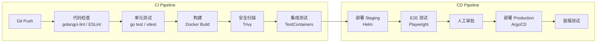

# OmniDev AI Platform — 开发规范

## 1. Git 工作流

### 1.1 分支策略

```
main (生产)
  ↑
  ├── release/v1.0 (发布分支)
  │     ↑
  │     └── develop (开发主线)
  │           ↑
  │           ├── feature/chat-module (功能分支)
  │           ├── feature/agent-system
  │           └── bugfix/fix-login
  │
  └── hotfix/fix-critical-bug (热修复)
```

| 分支 | 命名规则 | 生命周期 | 合并目标 |
|------|----------|----------|----------|
| main | main | 永久 | - |
| develop | develop | 永久 | main (通过 release) |
| 功能分支 | feature/{模块}-{描述} | 临时 | develop |
| 修复分支 | bugfix/{issue}-{描述} | 临时 | develop |
| 热修复 | hotfix/{描述} | 临时 | main + develop |
| 发布分支 | release/v{版本} | 临时 | main |

### 1.2 Commit 规范

**格式：** `<type>(<scope>): <description>`

```
类型 (type):
  feat      新功能
  fix       修复
  docs      文档
  style     格式（不影响代码运行）
  refactor  重构
  perf      性能优化
  test      测试
  build     构建系统
  ci        CI/CD
  chore     其他杂项

范围 (scope):
  gateway, chat, agent, rag, ide, workflow, mcp, deploy, billing, admin
  ui, proto, common, infra

示例:
  feat(chat): 添加多模型切换功能
  fix(auth): 修复 JWT 过期后未刷新的问题
  docs(api): 更新 Chat API 文档
  refactor(rag): 重构检索器接口
  perf(query): 优化消息列表查询性能
```

### 1.3 PR 规范

**标题：** 与 commit 格式一致

**模板：**
```markdown
## 变更说明
简述本次变更的内容和原因。

## 变更类型
- [ ] 新功能 (feat)
- [ ] 修复 (fix)
- [ ] 重构 (refactor)
- [ ] 文档 (docs)
- [ ] 其他

## 测试
- [ ] 单元测试通过
- [ ] 集成测试通过
- [ ] 手动测试通过

## 截图/录屏（如适用）

## 关联 Issue
Closes #123
```

---

## 2. Go 编码规范

### 2.1 项目分层

```
cmd/          → 入口点，仅组装依赖
internal/
  config/     → 配置结构体和加载
  domain/     → 领域模型（纯结构体 + 业务方法）
  repository/ → 数据访问接口 + 实现
  service/    → 业务逻辑（依赖 repository 接口）
  handler/    → gRPC/HTTP 处理器（调用 service）
  event/      → 事件发布和消费
migrations/   → SQL 迁移文件
```

### 2.2 依赖注入

使用 **Wire** 进行编译时依赖注入：

```go
// wire.go
func InitializeApp(cfg *config.Config) (*App, error) {
    wire.Build(
        // 基础设施
        NewPostgresDB,
        NewRedisClient,
        NewKafkaProducer,

        // Repository
        NewUserRepository,
        NewConversationRepository,

        // Service
        NewAuthService,
        NewChatService,

        // Handler
        NewAuthHandler,
        NewChatHandler,

        // App
        NewApp,
    )
    return nil, nil
}
```

### 2.3 错误处理

**统一错误类型：**
```go
// packages/go-common/errors/errors.go
type AppError struct {
    Code    int    `json:"code"`
    Message string `json:"message"`
    Detail  string `json:"detail,omitempty"`
    Err     error  `json:"-"`
}

func (e *AppError) Error() string { return e.Message }

// 预定义错误
var (
    ErrNotFound     = &AppError{Code: 404, Message: "resource not found"}
    ErrUnauthorized = &AppError{Code: 401, Message: "unauthorized"}
    ErrForbidden    = &AppError{Code: 403, Message: "forbidden"}
    ErrValidation   = &AppError{Code: 400, Message: "validation error"}
    ErrInternal     = &AppError{Code: 500, Message: "internal error"}
)
```

**错误包装：**
```go
user, err := s.userRepo.GetByID(ctx, id)
if err != nil {
    return nil, errors.Wrap(err, "failed to get user")
}
```

### 2.4 日志规范

```go
// 使用结构化日志
logger.Info("Chat completion started",
    zap.String("user_id", userID),
    zap.String("model", modelID),
    zap.Int("message_count", len(messages)),
)

logger.Error("Failed to call AI model",
    zap.String("model", modelID),
    zap.Error(err),
    zap.Duration("latency", elapsed),
)
```

**日志级别使用：**
| 级别 | 用途 |
|------|------|
| Debug | 开发调试，生产环境关闭 |
| Info | 正常业务事件 |
| Warn | 可恢复的异常 |
| Error | 需要关注的错误 |
| Fatal | 无法恢复，进程退出 |

### 2.5 gRPC 接口规范

```protobuf
// 请求命名：{Resource}{Action}Request
// 响应命名：{Resource}{Action}Response
// 空响应用 google.protobuf.Empty

service ChatService {
    // 创建会话
    rpc CreateConversation(CreateConversationRequest) returns (Conversation);

    // 列出会话（分页）
    rpc ListConversations(ListConversationsRequest) returns (ListConversationsResponse);

    // 获取单个
    rpc GetConversation(GetConversationRequest) returns (Conversation);

    // 更新
    rpc UpdateConversation(UpdateConversationRequest) returns (Conversation);

    // 删除
    rpc DeleteConversation(DeleteConversationRequest) returns (google.protobuf.Empty);

    // 流式聊天
    rpc ChatStream(ChatStreamRequest) returns (stream ChatChunk);
}

// 分页
message ListConversationsRequest {
    int32 page_size = 1;
    string page_token = 2;
    string filter = 3;
    string sort_by = 4;
}

message ListConversationsResponse {
    repeated Conversation conversations = 1;
    string next_page_token = 2;
    int32 total_count = 3;
}
```

### 2.6 数据库规范

**迁移文件命名：**
```
migrations/
├── 001_create_users.up.sql
├── 001_create_users.down.sql
├── 002_create_conversations.up.sql
├── 002_create_conversations.down.sql
└── ...
```

**SQL 编写规范：**
```sql
-- 表名：snake_case，复数形式
-- 列名：snake_case
-- 主键：id (UUID)
-- 外键：{table}_id
-- 索引：idx_{table}_{columns}
-- 唯一索引：uniq_{table}_{columns}

CREATE TABLE users (
    id            UUID PRIMARY KEY DEFAULT gen_random_uuid(),
    email         VARCHAR(255) NOT NULL,
    created_at    TIMESTAMPTZ NOT NULL DEFAULT NOW(),
    updated_at    TIMESTAMPTZ NOT NULL DEFAULT NOW()
);

CREATE INDEX idx_users_email ON users(email);
```

**Repository 模式：**
```go
// 接口定义（domain 层）
type UserRepository interface {
    Create(ctx context.Context, user *User) error
    GetByID(ctx context.Context, id uuid.UUID) (*User, error)
    GetByEmail(ctx context.Context, email string) (*User, error)
    Update(ctx context.Context, user *User) error
    Delete(ctx context.Context, id uuid.UUID) error
    List(ctx context.Context, params ListParams) ([]*User, int, error)
}

// 实现（repository 层）
type userRepository struct {
    db *pgxpool.Pool
}

func NewUserRepository(db *pgxpool.Pool) UserRepository {
    return &userRepository{db: db}
}

func (r *userRepository) Create(ctx context.Context, user *User) error {
    query := `INSERT INTO users (id, email, nickname, password_hash)
              VALUES ($1, $2, $3, $4)`
    _, err := r.db.Exec(ctx, query, user.ID, user.Email, user.Nickname, user.PasswordHash)
    return err
}
```

---

## 3. TypeScript/React 编码规范

### 3.1 文件组织

```
组件文件：PascalCase (UserProfile.tsx)
Hook 文件：camelCase，use 前缀 (useChat.ts)
工具文件：camelCase (formatDate.ts)
类型文件：camelCase (api.ts)
常量文件：UPPER_SNAKE_CASE (ROUTES.ts)
```

### 3.2 组件规范

```tsx
// 组件使用函数式组件 + TypeScript
interface UserCardProps {
  user: User;
  onSelect?: (user: User) => void;
  variant?: 'default' | 'compact';
}

export function UserCard({ user, onSelect, variant = 'default' }: UserCardProps) {
  const handleClick = useCallback(() => {
    onSelect?.(user);
  }, [user, onSelect]);

  return (
    <Card onClick={handleClick} className={cn(variant === 'compact' && 'p-2')}>
      <Avatar src={user.avatarUrl} fallback={user.nickname[0]} />
      <div>
        <h3>{user.nickname}</h3>
        <p className="text-muted-foreground">{user.email}</p>
      </div>
    </Card>
  );
}
```

### 3.3 状态管理

```typescript
// stores/chat-store.ts
import { create } from 'zustand';
import { devtools, persist } from 'zustand/middleware';

interface ChatState {
  conversations: Conversation[];
  activeId: string | null;
  isLoading: boolean;

  // Actions
  setActive: (id: string) => void;
  addConversation: (conv: Conversation) => void;
  fetchConversations: () => Promise<void>;
}

export const useChatStore = create<ChatState>()(
  devtools(
    persist(
      (set, get) => ({
        conversations: [],
        activeId: null,
        isLoading: false,

        setActive: (id) => set({ activeId: id }),

        addConversation: (conv) =>
          set((state) => ({
            conversations: [conv, ...state.conversations],
          })),

        fetchConversations: async () => {
          set({ isLoading: true });
          try {
            const data = await chatApi.listConversations();
            set({ conversations: data.conversations });
          } finally {
            set({ isLoading: false });
          }
        },
      }),
      { name: 'chat-store' }
    )
  )
);
```

### 3.4 API 调用

```typescript
// 使用 TanStack Query
import { useQuery, useMutation, useQueryClient } from '@tanstack/react-query';

export function useConversations() {
  return useQuery({
    queryKey: ['conversations'],
    queryFn: () => chatApi.listConversations(),
    staleTime: 30_000,  // 30 秒
  });
}

export function useCreateConversation() {
  const queryClient = useQueryClient();

  return useMutation({
    mutationFn: (data: CreateConversationInput) =>
      chatApi.createConversation(data),
    onSuccess: () => {
      queryClient.invalidateQueries({ queryKey: ['conversations'] });
    },
  });
}
```

---

## 4. API 设计规范

### 4.1 RESTful 规范

```
资源命名：复数名词，kebab-case
嵌套资源：最多 2 层
分页：page_size + page_token
排序：sort_by=field:asc|desc
过滤：filter=field:value
搜索：q=keyword

示例：
GET    /api/v1/conversations
POST   /api/v1/conversations
GET    /api/v1/conversations/{id}
PATCH  /api/v1/conversations/{id}
DELETE /api/v1/conversations/{id}
GET    /api/v1/conversations/{id}/messages
POST   /api/v1/conversations/{id}/messages
```

### 4.2 响应格式

```json
// 成功响应
{
  "data": { ... },
  "meta": {
    "page_size": 20,
    "next_page_token": "xxx",
    "total_count": 100
  }
}

// 错误响应
{
  "error": {
    "code": 400,
    "message": "validation error",
    "detail": "email is required",
    "request_id": "req_abc123"
  }
}

// 流式响应 (SSE)
data: {"type":"chunk","content":"Hello"}
data: {"type":"chunk","content":" world"}
data: {"type":"done","usage":{"input_tokens":10,"output_tokens":2}}
```

### 4.3 版本控制

```
URL 版本：/api/v1/*, /api/v2/*
Header 版本：Accept-Version: 2026-01-01
废弃通知：Deprecation 头 + 迁移指南
```

---

## 5. 测试规范

### 5.1 测试策略

| 层级 | 覆盖率目标 | 工具 | 速度 |
|------|-----------|------|------|
| 单元测试 | > 80% | go test / Vitest | 毫秒 |
| 集成测试 | 核心流程 | TestContainers | 秒 |
| E2E 测试 | 关键路径 | Playwright | 分钟 |
| 性能测试 | API 端点 | k6 | 分钟 |

### 5.2 Go 测试规范

```go
// 文件命名：*_test.go
// 函数命名：Test{Function}_{Scenario}_{Expected}

func TestUserService_Create_Success(t *testing.T) {
    // Arrange
    repo := NewMockUserRepository()
    svc := NewUserService(repo)
    input := &CreateUserInput{Email: "test@example.com"}

    // Act
    user, err := svc.Create(context.Background(), input)

    // Assert
    require.NoError(t, err)
    assert.Equal(t, input.Email, user.Email)
    assert.NotEmpty(t, user.ID)
}

func TestUserService_Create_DuplicateEmail(t *testing.T) {
    // Arrange
    repo := NewMockUserRepository()
    repo.On("GetByEmail", mock.Anything).Return(&User{}, nil)
    svc := NewUserService(repo)

    // Act
    _, err := svc.Create(context.Background(), &CreateUserInput{})

    // Assert
    assert.ErrorIs(t, err, ErrDuplicateEmail)
}
```

### 5.3 前端测试规范

```typescript
// 组件测试
import { render, screen, fireEvent } from '@testing-library/react';

describe('UserCard', () => {
  it('renders user info correctly', () => {
    render(<UserCard user={mockUser} />);
    expect(screen.getByText(mockUser.nickname)).toBeInTheDocument();
  });

  it('calls onSelect when clicked', () => {
    const onSelect = vi.fn();
    render(<UserCard user={mockUser} onSelect={onSelect} />);
    fireEvent.click(screen.getByRole('button'));
    expect(onSelect).toHaveBeenCalledWith(mockUser);
  });
});
```

---

## 6. 安全规范

### 6.1 代码安全

| 规则 | 说明 |
|------|------|
| 禁止硬编码密钥 | 使用环境变量或密钥管理服务 |
| SQL 参数化 | 禁止字符串拼接 SQL |
| 输入验证 | 所有外部输入必须验证 |
| 输出编码 | 防止 XSS，HTML 转义 |
| 日志脱敏 | 密码、Token、PII 不入日志 |
| 依赖审计 | 定期运行 `go mod audit` / `npm audit` |

### 6.2 密钥管理

```
开发环境：.env.local（不提交 Git）
测试环境：Kubernetes Secrets
生产环境：AWS Secrets Manager / HashiCorp Vault

.env.example（提交 Git，作为模板）
```

---

## 7. CI/CD 流程



---

## 8. 文档规范

| 文档类型 | 工具 | 位置 | 更新频率 |
|----------|------|------|----------|
| API 文档 | OpenAPI + buf | `docs/api/` | 随代码更新 |
| 架构文档 | Markdown | `docs/architecture/` | 架构变更时 |
| ADR | Markdown | `docs/adr/` | 架构决策时 |
| 代码注释 | GoDoc / JSDoc | 源码中 | 随代码更新 |
| README | Markdown | 每个服务根目录 | 随功能更新 |
| 变更日志 | CHANGELOG.md | 项目根目录 | 每次发布 |

---

## 9. 代码审查清单

### 功能
- [ ] 代码实现了需求描述的功能
- [ ] 边界条件已处理
- [ ] 错误路径已覆盖

### 安全
- [ ] 输入已验证
- [ ] SQL 参数化
- [ ] 敏感数据未入日志
- [ ] 权限检查已添加

### 性能
- [ ] 数据库查询已优化
- [ ] N+1 查询已避免
- [ ] 缓存已合理使用

### 可维护性
- [ ] 代码清晰易读
- [ ] 命名有意义
- [ ] 无重复代码
- [ ] 测试已添加

### 运维
- [ ] 日志充分
- [ ] 指标已暴露
- [ ] 配置可外部化
