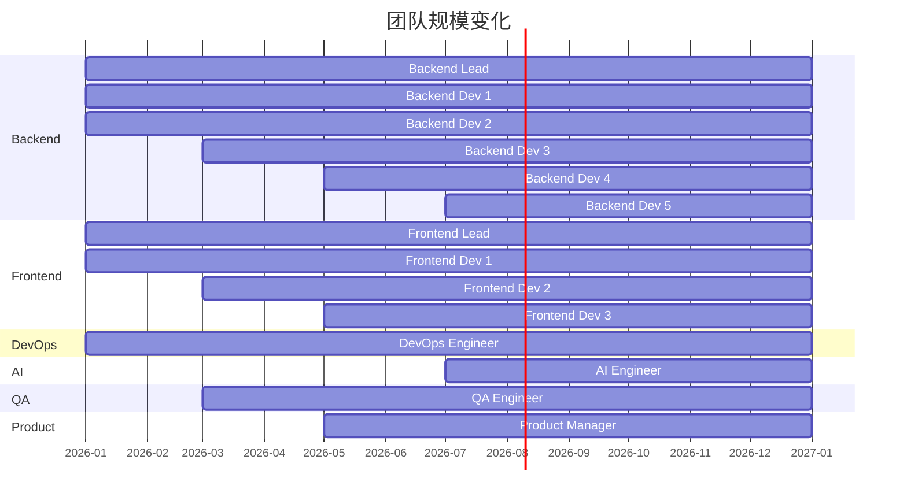
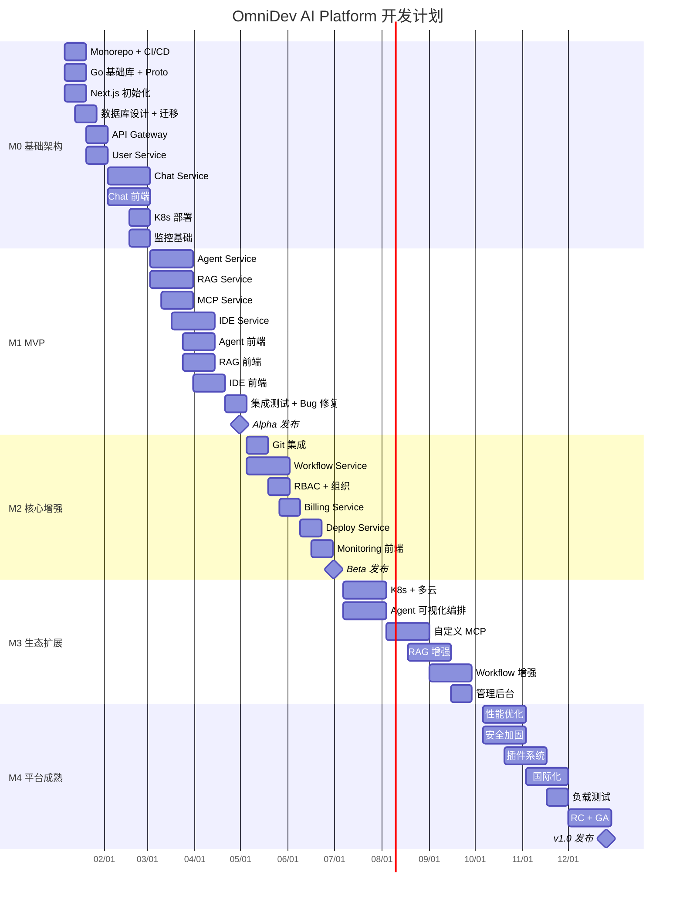

# OmniDev AI Platform — 里程碑规划

## 1. 整体时间线

```
Month 1-2    Month 3-4    Month 5-6    Month 7-9    Month 10-12
   │            │            │            │             │
   ▼            ▼            ▼            ▼             ▼
┌──────┐   ┌──────┐   ┌──────┐   ┌──────┐   ┌──────────┐
│ M0   │   │ M1   │   │ M2   │   │ M3   │   │   M4     │
│基础架构│   │ MVP  │   │核心增强│   │生态扩展│   │平台成熟  │
│  搭建  │   │ 发布  │   │  完善  │   │  开放  │   │  优化    │
└──────┘   └──────┘   └──────┘   └──────┘   └──────────┘
```

---

## 2. 详细里程碑

### M0：基础架构搭建（月 1-2）

**目标：** 建立开发基础设施，完成核心框架搭建

| 周 | 任务 | 交付物 | 负责人 |
|----|------|--------|--------|
| W1 | Monorepo 初始化 | 项目骨架、CI/CD Pipeline | DevOps |
| W1 | Go workspace + 基础库 | go-common 包 | Backend |
| W1 | Next.js 项目初始化 | web 应用骨架 | Frontend |
| W2 | Protobuf 定义 + 代码生成 | 所有 proto 文件 | Backend |
| W2 | 数据库设计 + 迁移 | SQL 迁移脚本 | Backend |
| W2 | Shadcn/ui 组件库 | UI 基础组件 | Frontend |
| W3 | PostgreSQL + Redis + Kafka | Docker Compose 本地环境 | DevOps |
| W3 | API Gateway 基础 | JWT 认证 + 限流 + 路由 | Backend |
| W3 | 用户服务 | 注册/登录/OAuth | Backend |
| W4 | 用户前端页面 | 登录/注册/设置页 | Frontend |
| W4 | CI Pipeline | Lint + Test + Build | DevOps |
| W5-6 | Chat Service 基础 | 多模型 Adapter + 流式 | Backend |
| W5-6 | Chat 前端 | 对话 UI + 代码高亮 | Frontend |
| W7-8 | 基础设施部署 | K8s 集群 + Helm Charts | DevOps |
| W7-8 | 监控基础 | Prometheus + Grafana | DevOps |
| W7-8 | 文档 | API 文档 + 开发指南 | All |

**里程碑验收：**
- [x] 开发环境 Docker Compose 一键启动
- [x] CI/CD Pipeline 自动运行
- [x] 用户可以注册/登录
- [x] 用户可以与 AI 对话（流式输出）
- [x] 本地 K8s 集群可以运行所有服务

**团队配置（6 人）：**
| 角色 | 人数 | 职责 |
|------|------|------|
| Backend Lead | 1 | 架构设计 + Chat Service |
| Backend Dev | 2 | User Service + Gateway |
| Frontend Lead | 1 | 架构设计 + Chat UI |
| Frontend Dev | 1 | 用户页面 + 组件库 |
| DevOps | 1 | CI/CD + K8s + 监控 |

---

### M1：MVP 发布（月 3-4）

**目标：** 核心功能可用，可对外发布 Alpha 版本

| 周 | 任务 | 交付物 |
|----|------|--------|
| W9 | Agent Service 基础 | Agent 执行 + Tool Calling |
| W9 | RAG Service 基础 | 文档上传 + Chunk + Embedding |
| W10 | MCP Service 基础 | 内置 MCP Server |
| W10 | Agent 沙箱 | Docker 沙箱执行 |
| W11 | IDE Service 基础 | Monaco Editor + 文件管理 |
| W11 | IDE 终端 | xterm.js + PTY |
| W12 | RAG 检索增强 | Chat 中 @引用知识库 |
| W12 | Agent 前端 | Agent 列表 + 执行监控 |
| W13 | IDE 前端 | 文件树 + 编辑器 + 终端 |
| W13 | RAG 前端 | 知识库管理 + 文档上传 |
| W14 | Prompt 模板 | 创建/管理/使用 Prompt |
| W14 | 多会话 | Tab 式多会话管理 |
| W15-16 | 集成测试 | 核心流程 E2E 测试 |
| W15-16 | Bug 修复 | Alpha 测试反馈修复 |
| W16 | Alpha 发布 | 内部 Alpha 版本 |

**里程碑验收：**
- [x] 用户可以创建 Agent 执行任务
- [x] 用户可以上传文档建立知识库
- [x] AI 对话可以引用知识库内容
- [x] 用户可以在 IDE 中编辑代码
- [x] 用户可以在终端中执行命令
- [x] Agent 可以在沙箱中运行代码

**新增人员（+4 人，共 10 人）：**
| 角色 | 人数 | 职责 |
|------|------|------|
| Backend Dev | +2 | Agent + RAG + IDE |
| Frontend Dev | +1 | Agent + IDE 前端 |
| QA | +1 | 测试 + E2E |

---

### M2：核心增强（月 5-6）

**目标：** 完善核心功能，发布 Beta 版本

| 周 | 任务 | 交付物 |
|----|------|--------|
| W17 | Git 集成 | commit/push/pull/branch |
| W17 | Code Review | Diff 视图 + 行内评论 |
| W18 | Workflow Service | Temporal 集成 + 基础节点 |
| W18 | 工作流编辑器 | React Flow 画布 |
| W19 | Workflow 前端 | 节点面板 + 属性配置 |
| W19 | AI 节点 + HTTP 节点 | 工作流可调用 AI 和 API |
| W20 | RBAC 权限 | 角色 + 资源级权限 |
| W20 | 组织管理 | 创建组织 + 邀请成员 |
| W21 | Billing Service | Token 计量 + 用量统计 |
| W21 | 支付集成 | Stripe 支付 |
| W22 | Deploy Service | Docker 一键部署 |
| W22 | 域名管理 | 自定义域名 + SSL |
| W23 | Monitoring 前端 | Dashboard + 日志搜索 |
| W23 | 告警规则 | 阈值告警 + 通知 |
| W24 | Beta 发布 | 公开 Beta 版本 |

**里程碑验收：**
- [x] 用户可以使用可视化工作流
- [x] 用户可以进行 Git 操作和 Code Review
- [x] 组织可以管理成员和权限
- [x] 用户可以查看用量和支付
- [x] 用户可以一键部署 Docker 应用
- [x] 用户可以查看监控 Dashboard

**新增人员（+3 人，共 13 人）：**
| 角色 | 人数 | 职责 |
|------|------|------|
| Backend Dev | +1 | Workflow + Deploy |
| Frontend Dev | +1 | Workflow 编辑器 |
| Product Manager | +1 | 产品规划 + 用户反馈 |

---

### M3：生态扩展（月 7-9）

**目标：** 建立插件生态，支持高级功能

| 周 | 任务 | 交付物 |
|----|------|--------|
| W25-26 | K8s 部署 | Helm Chart + 自动伸缩 |
| W25-26 | 多云支持 | Terraform AWS/Azure/GCP |
| W27-28 | Agent 可视化编排 | 拖拽式 Agent 工作流 |
| W27-28 | Agent 模板市场 | 预置模板 + 发布/安装 |
| W29-30 | 自定义 MCP Server | 用户添加 MCP Server |
| W29-30 | 更多 MCP 内置 | Notion/Jira/Figma |
| W31-32 | RAG 增强 | OCR + Rerank + 代码索引 |
| W31-32 | GitHub 导入 | 仓库克隆 + 代码解析 |
| W33-34 | Workflow 增强 | SQL/Email/Slack 节点 + 定时 |
| W33-34 | Prompt Compare | 多模型对比 |
| W35-36 | 管理后台完善 | 用户/模型/审计管理 |

**里程碑验收：**
- [x] 用户可以部署到 K8s 和多云
- [x] 用户可以可视化编排 Agent
- [x] 用户可以添加自定义 MCP Server
- [x] RAG 支持 OCR 和代码索引
- [x] 工作流支持更多节点类型
- [x] 管理后台功能完整

**新增人员（+2 人，共 15 人）：**
| 角色 | 人数 | 职责 |
|------|------|------|
| Backend Dev | +1 | MCP + 多云部署 |
| AI Engineer | +1 | RAG 增强 + OCR |

---

### M4：平台成熟（月 10-12）

**目标：** 平台稳定、性能优化、正式发布

| 周 | 任务 | 交付物 |
|----|------|--------|
| W37-38 | 性能优化 | 查询优化 + 缓存策略 + CDN |
| W37-38 | 安全加固 | 渗透测试 + 安全审计 |
| W39-40 | 链路追踪 | Jaeger 集成 + 全链路追踪 |
| W39-40 | AI 异常检测 | 基于 AI 的异常告警 |
| W41-42 | 插件系统 | 插件注册 + 沙箱隔离 |
| W41-42 | API SDK | Go/Python/JS SDK |
| W43-44 | 国际化 | 日文 + 韩文 |
| W43-44 | 文档完善 | 用户手册 + API 参考 |
| W45-46 | 负载测试 | k6 压力测试 + 优化 |
| W45-46 | 灾备演练 | 故障恢复 + 数据恢复 |
| W47-48 | RC 版本 | Release Candidate |
| W48 | 正式发布 | v1.0 GA |

**里程碑验收：**
- [x] 系统通过安全审计
- [x] 性能指标达标（见 NFR）
- [x] SLA 达到 99.95%
- [x] 文档完整
- [x] v1.0 正式发布

---

## 3. 人力规划



**峰值团队：15 人**

| 阶段 | 人数 | 角色分布 |
|------|------|----------|
| M0 (月 1-2) | 6 | 3 Backend + 2 Frontend + 1 DevOps |
| M1 (月 3-4) | 10 | 5 Backend + 3 Frontend + 1 DevOps + 1 QA |
| M2 (月 5-6) | 13 | 6 Backend + 4 Frontend + 1 DevOps + 1 QA + 1 PM |
| M3 (月 7-9) | 15 | 7 Backend + 4 Frontend + 1 DevOps + 1 QA + 1 PM + 1 AI |
| M4 (月 10-12) | 15 | 同 M3 |

---

## 4. 里程碑甘特图



---

## 5. 风险管理

| 风险 | 概率 | 影响 | 缓解措施 |
|------|------|------|----------|
| AI 模型 API 变更 | 高 | 中 | Adapter 模式隔离、多模型支持 |
| Go 人才招聘困难 | 中 | 高 | 内部培训、远程招聘 |
| 安全漏洞 | 中 | 极高 | 定期审计、Bug Bounty |
| 性能瓶颈 | 中 | 中 | 提前压测、架构预留 |
| 范围蔓延 | 高 | 高 | 严格 MVP 定义、PM 把关 |
| 第三方服务中断 | 低 | 中 | 多供应商、降级策略 |
| 数据丢失 | 低 | 极高 | 多副本、定期备份、灾备演练 |

---

## 6. 质量门禁

| 里程碑 | 质量标准 |
|--------|----------|
| M0 | 单元测试覆盖率 > 70%、CI 绿色、无 P0 Bug |
| M1 | 单元测试覆盖率 > 75%、E2E 核心流程通过、无 P0/P1 Bug |
| M2 | 单元测试覆盖率 > 80%、性能测试通过、安全扫描通过 |
| M3 | 覆盖率 > 80%、负载测试通过、文档完整 |
| M4 | 覆盖率 > 85%、全链路测试通过、安全审计通过、SLA 验证 |

---

## 7. 成本预估（12 个月）

| 项目 | 月成本 | 12 个月 |
|------|--------|---------|
| 人力（15 人峰值） | ~$150K | ~$1.5M |
| 云基础设施 | ~$2K-5K | ~$40K |
| AI API 费用（开发测试） | ~$1K | ~$12K |
| 工具/服务订阅 | ~$2K | ~$24K |
| **合计** | | **~$1.6M** |

---

## 8. 发布计划

| 版本 | 时间 | 内容 |
|------|------|------|
| v0.1.0-alpha | 月 4 末 | 内部 Alpha，核心功能可用 |
| v0.2.0-beta | 月 6 末 | 公开 Beta，功能基本完整 |
| v0.3.0-rc | 月 9 末 | Release Candidate，生态扩展 |
| v1.0.0 GA | 月 12 末 | 正式发布，生产就绪 |

**发布节奏：**
- Alpha/Beta: 每 2 周一个版本
- RC: 每月一个版本
- GA 后: 每月 minor、每季度 major
